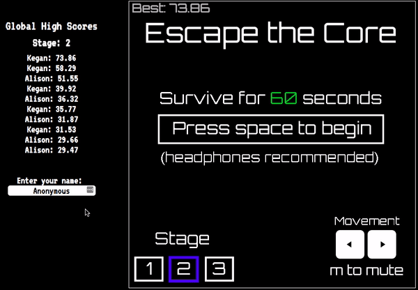

# Escape-the-Core

A fast-paced psuedo-rhythm game where the player must find the gaps in the enclosing shapes to escape the core.

Play now! - http://kegan-cunningham.me/Escape-the-Core

## Features
1. The player controls a small circle and can orbit the center circle by pressing the left and right keys.
2. Shapes close in on the player, but always leave one open space the player can slip through.
3. The player dies and must restart upon collision with any of the shapes.
4. Music plays in the background, and the center circle pulses with the beat.
5. The music loops when the song ends, and when starting or restarting the level it starts at one of several possible starting points to avoid too much repetition
6. Sound effects, including an encouraging voice-over every 10 seconds
7. The colors of the lines are constantly changing.
8. The entire canvas rotates semi-randomly.
9. The player wins if they survive for 60 seconds, but may keep playing until they die, though the game gets noticeably harder after 60 seconds.
10. Takes advantage of local storage to remember the player's progress and best scores.
11. Multiple levels of increasing difficulty, that are unlocked by beating the previous level.
12. Google Firebase integration for global high score tracking. The player can input their name to be saved alongside the high score.

## Technologies, Libraries, APIs

This project uses vanilla JS, HTML5, and CSS, along with the Canvas library and Google Firebase.

Inspired by Terry Cavanagh's Hexagon - https://terrycavanaghgames.com/hexagon/
